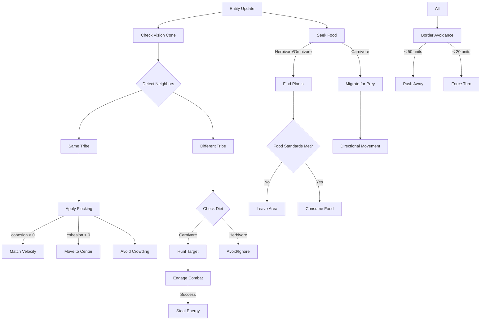

# Gene-Sim Behavior System Documentation

## Overview

The simulation implements a complex emergent behavior system where entities make decisions based on genetic traits, environmental factors, and social dynamics. Each entity has 9 genes that influence their behavior and survival strategies.

## Genetic Traits

### 1. **Speed** (0-100)

- Base movement velocity
- Affects energy consumption (quadratic relationship)
- Modified by metabolism efficiency

### 2. **Vision** (20-150)

- Detection range for food, allies, and enemies
- Increases with hunger for carnivores (up to 2x when desperate)
- Limited by view angle

### 3. **Metabolism** (0.05-0.30)

- Base energy consumption rate
- Affects maximum sustainable speed
- Diet-modified: carnivores -30%, herbivores +50%

### 4. **Reproduction Chance** (0.01-0.20)

- Probability of reproduction when conditions are met
- Requires energy > 50
- Blocked when crowd stress > 0.7

### 5. **Aggression** (0.0-1.0)

- Base combat probability
- Damage dealing multiplier
- Inversely affects mating probability

### 6. **Cohesion** (0.0-1.0)

- Flocking behavior strength
- Pack hunting coordination
- Group movement synchronization

### 7. **Food Standards** (0.0-1.0)

- Pickiness about food density areas
- Triggers migration when unsatisfied
- Affects search radius

### 8. **Diet** (-1.0 to 1.0)

- -1.0 = Pure herbivore
- 0.0 = Omnivore
- 1.0 = Pure carnivore
- Affects energy sources and efficiency

### 9. **View Angle** (60-180 degrees)

- Field of vision cone
- Limits what entities can detect
- Trade-off: wide view vs focused attention

## Behavioral Influences

### Energy Management

```
Energy Loss = (BaseCost + MovementCost) × AgeFactor × DietModifier

Where:
- BaseCost = metabolism × 1.5 × DietFactor
- MovementCost = speed² × 0.000005 × metabolism × DietEfficiency
- DietFactor = 1 + (herbivore × 0.5) - (carnivore × 0.3)
- DietEfficiency = 1 - (carnivore × 0.5)
```

### Hunting Behavior

**Trigger Conditions:**

- Diet > 0.2 (carnivorous tendency)
- Energy < HuntingThreshold
- HuntingThreshold = 95 - (carnivoreLevel × 35)

**Target Selection Score:**

```
PreyScore = WeaknessScore + ProximityScore + EnemyBonus + DesprationModifier
- WeaknessScore = (100 - targetEnergy) / 100
- ProximityScore = (1 - distance/visionRange) × 0.5
- EnemyBonus = +1.0 if different tribe
- DesperationModifier = × (1 + hungerDesperation × 0.5)
```

**Pack Hunting:**

- Activated when cohesion > 0.4
- Damage bonus: × (1 + packHuntBonus × 0.5)
- Success rate: × (1 + packHuntBonus × 0.5)
- Coordinated surrounding movement

### Movement Decision Tree



## Cross-Effects and Interactions

### 1. **Crowd Dynamics**

- Crowd Stress = min(1, nearbyCount / 15)
- Affects reproduction (blocked > 0.7)
- Increases separation force (quadratic)
- Triggers pressure waves in dense groups
- Reduces flocking when > 10 nearby

### 2. **Energy-Speed-Metabolism Triangle**

```
Effective Speed = Base Speed × min(1, metabolism / 0.15)
Movement Cost ∝ Speed² × Metabolism × DietFactor
→ High metabolism enables high speed but costs more energy
→ Carnivores: efficient movement, lower base cost
→ Herbivores: higher constant drain, less efficient movement
```

### 3. **Vision-Diet-Hunger Cascade**

```
Hunger → Increased Vision Range (carnivores)
      → Lower Prey Standards
      → Higher Aggression
      → Pack Coordination Activation
```

### 4. **Tribal Dynamics**

- Group Support = nearbyAllies / max(1, nearbyEnemies)
- Combat Success × min(2, 1 + groupSupport × 0.2)
- Pack Hunting requires tribal cohesion
- Hybrid offspring (if enabled) get unique tribe ID

### 5. **Food Chain Pressure**

```
Carnivore Success → Herbivore Population ↓
                  → Food Regeneration ↑
                  → Herbivore Recovery
                  → Carnivore Food Available ↑
```

### 6. **Migration Patterns**

- Food scarcity → Survival instinct migration
- No prey nearby → Carnivore roaming
- Food standards unmet → Picky eater migration
- Crowd stress → Dispersion pressure

## Emergent Behaviors

### Pack Hunting

When `cohesion > 0.5` and `diet > 0.3`:

- Coordinated prey targeting
- Surrounding formation
- Shared kill benefits
- Group migration when prey scarce

### Grazing Herds

When `cohesion > 0.3` and `diet < -0.3`:

- Synchronized movement to food
- Group protection through numbers
- Collective predator detection

### Territorial Control

High aggression tribes:

- Clear areas of competitors
- Defend food-rich zones
- Create safe breeding grounds

### Nomadic Carnivores

Low prey availability:

- Long-range exploration
- Energy conservation between hunts
- Following herbivore migrations

### Border Behavior

Distance-based response:

- 50 units: Gradual avoidance
- 20 units: Strong repulsion
- 5 units: Hard bounce

## Performance Optimizations

### Spatial Hashing

- O(1) neighbor lookup
- Limited to ~40 checks per entity
- Vision-based cell queries

### Staggered Updates

- Food checks: Every 3rd frame
- Stats: 10Hz update rate
- View angle culling

### Energy Balance

- Carnivores: High burst, low sustain
- Herbivores: Constant moderate drain
- Death → Immediate slot recycling

## Configuration Constants

```javascript
const CONFIG = {
  // Vision
  MAX_NEIGHBOR_CHECKS: 40,
  VIEW_ANGLE_DEFAULT: 120, // degrees
  
  // Energy
  ENERGY_MAX: 100,
  ENERGY_INITIAL: 50,
  CARNIVORE_BONUS: 1.5, // starting energy
  
  // Movement
  BORDER_MARGIN: 50,
  CRITICAL_MARGIN: 20,
  BOUNCE_FORCE: 10,
  
  // Crowd
  OPTIMAL_GROUP: 4,
  CROWD_LIMIT: 15,
  REPRODUCTION_CROWD_LIMIT: 0.7,
  
  // Combat
  BASE_DAMAGE: 8,
  ALLY_DAMAGE_BONUS: 1.5,
  CARNIVORE_DAMAGE_MULT: 1.5,
  
  // Food
  PLANT_EFFICIENCY: 8, // energy per food unit
  CORPSE_ENERGY_RATIO: 0.75
}
```

## Balancing Considerations

1. **Energy Economy**: Movement costs must allow carnivores to reach prey
2. **Vision Range**: Must exceed typical prey spacing
3. **Reproduction Rate**: Must balance death rate for stability
4. **Food Regeneration**: Must support baseline herbivore population
5. **Aggression Costs**: Must not dominate over other strategies
6. **Pack Size**: Limited by crowd stress mechanics
7. **Migration Distance**: Must discover new resources before starvation
